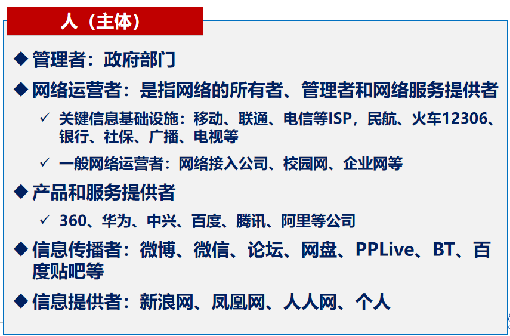
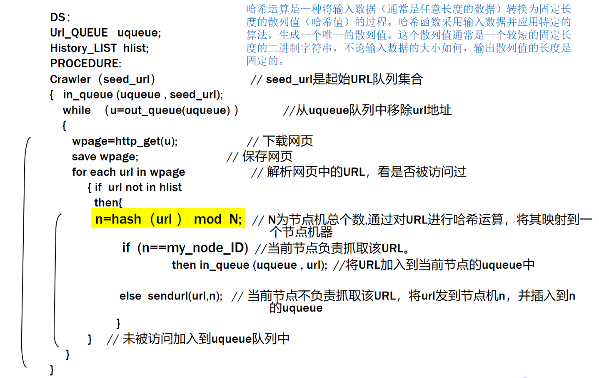
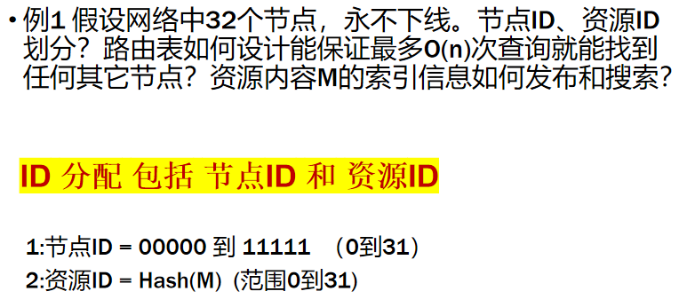
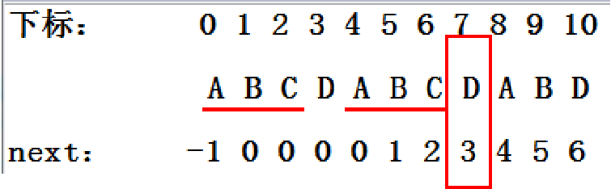
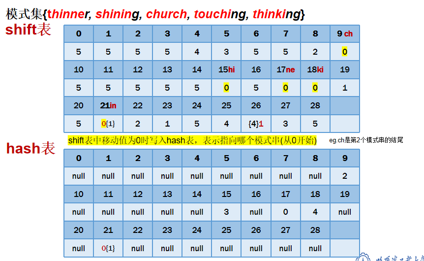
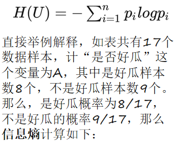
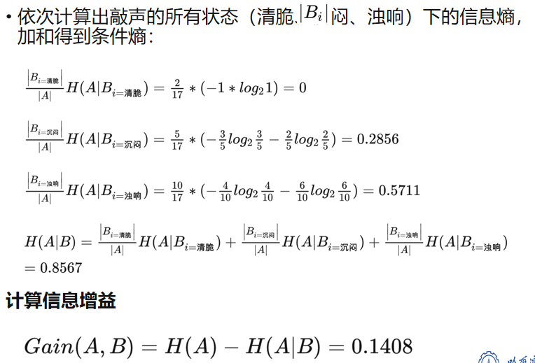
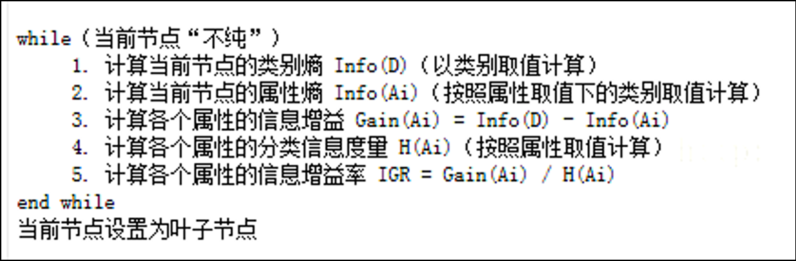
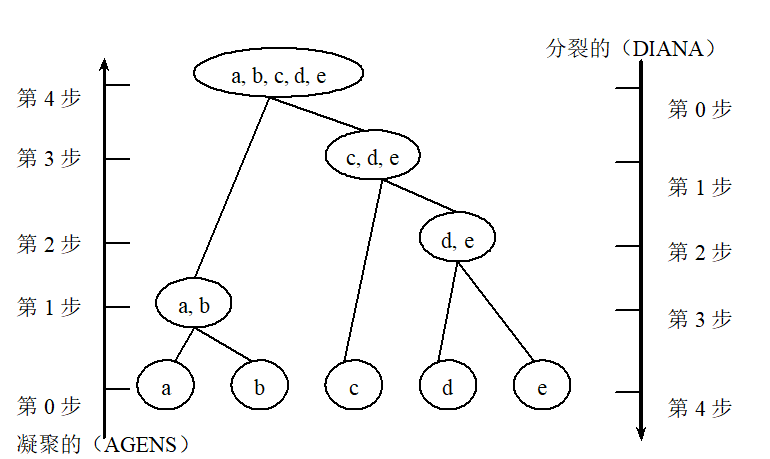
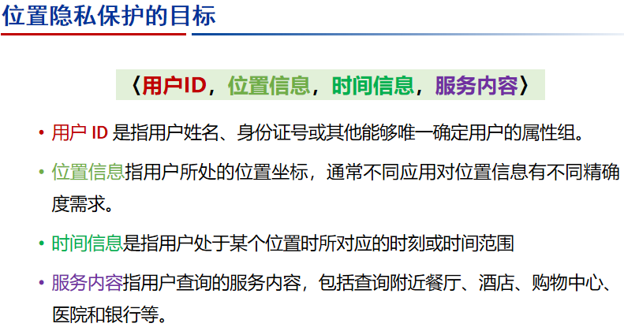

# 第一章 概述
## 1.网络安全威胁的主体有哪些?

## 2.什么是网络空间?网络空间的四要素包括哪些?

- **网络空间**:就是所有由可对外交换信息的电磁设备作为载体，通过与人互动而形成的虚拟空间。包括互联网、通信网、广电网、物联网、社交网络、计算系统、通信系统、控制系统等。
- **四要素**：“***网络角色***”依托“***信息通信技术系统***”以进行“***广义信号***”的“***交互***”。
  - **信息通信技术系统**：包括互联网、各种电信网与通信系统、各种传播系统与广电网、各种计算机系统、各类关键工业设施中的嵌入式处理器和控制器等声光电磁或数字信息处理设备，用“***设施***”来表征。
  - **广义信号**：是指基于声、光、电、磁等各类能够用于表达、存储、加工、传输的电磁信号，以及量子信号、生物信号等能够与电磁信号进行交互的信号形态，这些信号通过在信息通信技术系统中进行加工处理而成为“信息”，用“***数据***”来表征。“设施”与“数据”反映的是信息通信技术基础设施。
  - **网络角色**：是指产生、传输广义信号的主体，用“***用户***”来表征；
  - **交互**：是指用户借助广义信号，以信息通信技术设施为平台，以信息通信技术为手段，达到产生信号、保存数据、修改状态、传输信息、输出结果等表达人类意志的行为，用“***操作***”来表征。“用户”与“操作”反映的是“与信息通信技术相关的活动”。

## 3.《网络安全法》中的主体、客体主要有哪些?试列举各主体的基本责任和义务。 

## 4.什么是网络空间安全?网络空间安全研究方向有哪些?

## 5.国家网络强国战略的主要内容?我国政府中网络安全部门主要有哪些?

## 6.什么是网络空间主权?基本原则是什么?(独立平等自主管辖)

## 7.什么是信息内容安全?

- **信息内容安全**：主要涉及对传播信息的有效审查监管，剔除非授权信息（非法信息、泄密信息、垃圾邮件等），保护授权信息。

## 8.信息内容安全的主要威胁有哪些?有哪些典型事件? (净网反恐反腐知识产权邪教反分裂隐私保护)

## 9.信息内容安全技术主要包括哪些?

## 10.信息内容安全技术面临的挑战是什么?(数据量大，计算复杂度高，网络技术新，社会矛盾深）

# 第二章 网络信息获取

## 1 网络信息被动获取 

### 1）网卡的四种接收模式

- **广播方式：**该模式下的网卡能够接收网络中的广播信息。
- **组播方式：**设置在该模式下的网卡能够接收组播数据。
- **直接方式：**在这种模式下，只有目的网卡才能接收该数据。
- **混杂模式：**在这种模式下的网卡能够接收一切通过它的数据，而不管该数据是否是传给它的。 
- **旁路数据获取需要网卡在混杂模式** 

### 2）串行和旁路数据获取的区别 

- **串联监控模式：**一般是通过**网关或者网桥**的模式来进行监控

- **旁路监控模式：**一般是指通过**交换机或集线器**等网络设备的“端口镜像”功能来实现监控

  

- **旁路**部署起来**比较灵活方便**，不会影响现有的网络结构，串行需要对现有网络结构进行变动        

- **旁路**模式对原始传递的数据包**不会造成延时**，不会对网速造成任何影响。而串联模式是串联在网络中的，那么所有的数据必须先经过监控系统，通过监控系统的分析检查之后，才能够发送到各个客户端，所以会对网速有一定的延时。        

- **旁路**监控设备一旦**故障或者停止运行**，**不会影响现有网络**。而串联监控设备如果出现故障，会导致网络中断，导致网络单点故障。

### 3）伯克利数据包过滤器BPF的原理（在协议栈处理之前拷贝，应用tcpdump） 

- 目的是为了提供一种过滤包的方法，并且要避免从内核空间到用户空间的无用的数据包复制行为

- BPF主要由**网络转发**部分和**数据包过滤**两部分组成

  - 网络转发部分是从**链路层**捕获数据包并把它们转发给数据过滤部分
  - 数据包过滤部分是从接收到的数据包中接收过滤规则决定的网络数据包，其他数据包被丢弃

- BPF工作在操作系统的**内核层**，效率很高

  - 使用了数据缓存机制，使捕获数据包**缓存在内核**中，达到一定数量再传递给应用程序

- 数据包过滤器（BPF）主要作用，就是根据用户输入的过滤规则，只将用户关心的数据包拷贝至 tcpdump，这样能够减少不必要的数据包拷贝，降低抓包带来的性能损耗。

- 思考：如果某些数据包被 iptables （集成在 Linux 内核中的包过滤防火墙系统）封禁，是否可以通过 tcpdump 抓到包？

  - 因为 Linux 系统中netfilter（Linux 防火墙机制）是工作在协议栈阶段的，tcpdump 的过滤器（BPF）工作位置在协议栈之前，所以当然是可以抓到包了！

  

### 4）IP头、TCP头、UDP头的关键字段有哪些 

### 5）Libpcap或winpcap捕包的基本流程

## 2 高性能捕包 

### 1）网络数据包由网卡到用户空间进行了几次拷贝。

-  一个网络数据包通过网卡进入内核，然后再进入用户空间的时候，**至少会经过2次data copy**

### 2）操作系统消除拷贝的方式（DMA方式，mmap共享内存的原理，ebpf）

-  **直接内存存取DMA方式：**允许外围设备（硬件子系统）**直接访问系统主内存**的机制。

  - 系统主内存于硬盘或网卡之间的数据传输可以绕开 CPU 的全程调度
  - 使用DMA技术，仍然需要把数据**从网卡拷贝到主存**——但是，拷贝的过程中，CPU是完全不需要参与的。既然CPU不参与，就不会有任何CPU资源消耗，data copy带来的损耗就可以避免开了，所以**这一层的data copy就被cut了**。

- **mmap共享内存的原理：**实现**内核到用户层**的地址映射（共享内存的一般使用模式）

  - 在linux中，调用 mmap() 来代替调用 read来减少拷贝次数

    

    

  - 虚拟内存可以通过页目录、页表映射到物理内存地址，也可以直接映射到物理磁盘上（的文件）去

  - 文件又是多个进程共享的（不用区分内核与用户进程）

  - 内核的某一块内存区域映射到一个文件，而用户进程（server进程）又关联到这一个文件，那么这个用户进程（server进程）就可以直接操作Linux内核的某块内存区域了。

  - 内核中的这块内存区域再被设定为网卡DMA映射的内存区，“零拷贝”也就实现了

- **ebpf：**ebpf是比较新的扩展的BPF技术，具有更为庞大的功能体系。
- **xbp：**是Linux 内核中提供高性能、可编程的网络数据包处理框架。

### 3）网卡设备厂商零拷贝的技术（DPDK） 

- DPDK简单的说就是基于Linux系统运行，用于快速数据包处理的函数库与驱动集合，专注于网络应用中数据包的高性能处理
- DPDK**绕过了 Linux 内核协议栈对数据包的处理过程**，在**用户态空间**实现**数据包的收发与处理**。在内核看来， DPDK 就是一个普通的用户态进程，它的编译、链接和加载方式和普通程序没有什么两样。
- **DPDK关键技术：**
  - **UIO技术：**在用户空间进行设备驱动程序开发的框架。它提供了一种简单而灵活的方法，允许开发者**直接在用户空间中访问和控制设备**，而**无需使用内核驱动程序**。
    - 通过内核模块和用户空间库的组合，**将设备映射到用户空间的虚拟地址空间中**（mmap()），使开发者可以直接读取和写入设备的寄存器、执行设备特定的操作，而无需编写内核代码。
    - 不适用于所有类型的设备，主要适用一些简单的设备
    - 传统的数据包获取方式：网卡 -> Kernel驱动 -> Kernel TCP/IP协议栈 -> Socket接口 -> 业务
    - 基于UIO：网卡 -> DPDK轮询模式-> DPDK基础库 -> 业务
  - **PMD模式：**DPDK的**UIO驱动屏蔽了硬件发出中断**，然后在**用户态**采用**主动轮询**的方式，这种模式被称为PMD
    - DPDK采用轮询的方式，直接访问RX和TX描述符而没有任何中断，以便在用户的应用程序中快速接收，处理和传送数据包。这样可以**减少CPU频繁中断，切换上下文带来的消耗**。
  - **HugePages：**DPDK采用HugePages ，在x86-64下支持2MB、1GB的页大小，大大**降低了总页个数和页表的大小**，从而大大降低TLB miss的几率，提升CPU寻址性能。
- DPDK核心技术：
  - 内存池技术：内核空间和用户空间的内存交互不进行拷贝，只做控制权转移
  - 大页内存管理：上层应用可以很方便使用 API 申请使用大页内存，同时也兼容普通的内存申请。
  - 无锁环形队列
  - poll-mode网卡驱动：完全抛弃中断模式，基于轮询方式收包，避免了中断开销。
  - CPU亲和性：将一个线程或多个线程绑定到一个或多个 CPU 上，这样在线程执行过程中，就不会被随意调度
  - 多核调度框架

### 4）ebpf xdp和DPDK实现零拷贝的区别

## 3 网络信息主动获取 

### （1）网络信息搜索系统的一般结构（四个部分）

- **搜索器（爬虫）：**尽可能多、尽可能快地搜集各种类型的新信息，定期更新已经搜集过的旧信息，以避免死连接和无效连接。
- **索引器：**理解搜索器所搜索的信息，从中抽取出索引项，用于表示文档以及生成文档库的索引表。
- **检索器：**根据用户的查询在索引库中快速检出文档，进行文档与查询的相关度评价，对将要输出的结果进行排序，并实现某种用户相关性反馈机制。
- **用户接口：**输入用户查询、显示查询结果、提供用户相关性反馈机制。主要的目的是方便用户使用搜索引擎，高效率、多方式地从搜索引擎中得到有效、及时的信息。

### （2）通用爬虫的一般框架（队列） 

### （3）单机爬虫抓取算法，多机抓取算法 

- 网页的抓取策略可以分为深度优先、广度优先和最佳优先三种， 深度优先在很多情况下会导致爬虫的陷入(trapped)问题，目前常见的是广度优先和最佳优先方法。
- 最佳优先搜索策略：按照一定的**网页分析算法**，预测候选URL与目标网页的相似度，或与主题的相关性，并选取评价最好的一个或几个URL进行抓取，只访问经过网页分析算法预测为“有用”的网页。

                                                                                                                                                                                                                                                                                                                                                                                                                                                                                                                                                                                                                                                                                                                                                                                                                                                                                                                                                                                                                                                                                                                                                                                                                                                                                                                                                                                                                                                                                                                                                                                                                                                                                                                                                                                                                                                                                                                                                                                                                                                                                                                                                                                                                                                                                                                                                                                                                                                                                                                                                                                                                                

### （4）PageRanks算法及本思想，会计算（M矩阵的构建，PR值的推导 

- 某网页被指向的次数越多，则它的重要性越高；越是重要的网页，所链接的网页的重要性也越高。

- PageRank根据网站的外部链接和内部链接的数量和质量衡量网站的价值。

- 假设每个网页都有一个初始的PageRank值，代表这个网页的重要度。

- PageRank的计算可以在互联网的有向图上进行，通常是一个迭代过程

- 通过迭代，不断计算所有网页的PageRank值，直到收敛为止

  

  

  

  

### （5）dead end问题和spider traps问题如何修正

- **Dead Ends问题：**C没有任何出链（out-links）这就是 Dead Ends，Dead Ends 会导致网站权重变为 0

  

  

  

- **Spider Traps 问题：**某一点的出链仅只向自己，最终使该点的 PR 值都会归于 1，其他归为 0

  

  

  

  

  

### （6）网络信息的主动获取和被动获取的区别

## 4 社交网络和P2P信息获取 

### （1）P2P 系统结构的分类 

- 文件共享是P2P网络中最为典型的应用

### （2）各种结构的P2P系统内容发布和检索的方式 

- **基于目录服务器的P2P网络：**（中心式拓扑 、星形拓扑）

  

  

  

  - 索引发布和内容定位通过目录服务器进行,因此 查询简单、高效，但是和客户/服务器模式一 样，目录服务器存在瓶颈和单点失效问题，而 且可扩展性差

- **完全分布式的P2P网络：**文件检索由网络中所有节点共同完成，从而彻底取消了中心服务器，成为纯粹的对等网，文件查询采用泛洪（flood）机制

  

- **层次P2P网络：**将系统中的节点分成两种：超级节点和普通节点

  

  

  

- **结构化P2P网络**

### （3）结构化P2P的分布式哈希表结构DHT的原理 

- 为了在提高文件搜索效率的同时又**不依靠于中心节点或局部中心节点**，结构化对等网出现了

- 这类系统中没有中心服务器，是**纯粹的对等网**，其网络拓扑结构遵循特定的图

- 这类系统都基于分**布式哈希表（DHT）**，也被称为分布式哈希表系统。

- 结构化P2P: 直接根据**查询内容的关键字定位其索引的存放节点** ，索引为<Key, Value>对

- **DHT原理：**

  - **Hash函数**：根据给定的一段任意长的消息计算出一个固定长度的比特串， 通常称为消息摘要（MD）

    - 几乎不可逆
    - 唯一性：无法找到两条具有同样相同摘要的不同消息
      - **将节点IP地址的摘要作为节点ID**，保证 了节点ID在P2P环境下的唯一性
    - 常用的Hash函数：MD5、SHA-1

  - **过程：**

    

    

    - 在许多情况下,节点ID为节点IP地址的Hash摘要

  - **索引发布和内容定位**

    

### （4）给定节点数如何构造每个节点的路由表，保证O(logn)的时间复杂度可以找到任何一个节点 

### （5）KAD网络节点路由表K桶的构造，节点查询的原理

- KAD属于一种典型的结构化P2P。

  

  

  

  

  

  

  

  

# 第三章 字符串匹配

## 1. 模式串匹配算法的分类 

## 2. 单模式匹配算法 

- BF算法：在每趟匹配不成功时存在大量回溯，没有利用已经部分匹配成功提供的潜在信息
- KMP算法：充分利用已经比较过的字符信息来提高效率
- BM算法：利用匹配失败时获得的信息出发提高效率（坏字符和好后缀）

## 3. BF算法，了解基本思想，知道时间复杂度 

- 主要思想：从左向右暴力匹配，依次比较，**每次移动一个字符位置**，**存在大量回溯**。比较方向可以任意选定。**无预处理阶段**。
- 在主串 s 中从第 i ( i  的 初值为 start)个字符起，并且长度和 t 串相等的子串和 t  比较，若相等，则求得函数值为 i  , 否则 i 增1 ，直至串 s 中不存在从  i 开始和 t 相等的子串为止。
- 注：找到了相匹配的字符串也依旧 i 加1
- **时间复杂度：O(n*m)**
  - n：表示文本（或目标字符串）的长度
  - m：表示模式（或子字符串）的长度。

## 4. KMP算法

### （1）算法思想，如何控制不回溯  

### （2）next函数， 和文本串无关，寻找最长前缀后缀 

- next函数：由当前失配位置 j ，可以计算出滑动位置 k（即比较的新起点）
- k=next[j]的实质就是找T1T2…Tj-1中的最长相同的前缀（T1T2…Tk-1 ）和后缀（Tj-(k-1)T2…Tj-1）
- **寻找最长的相同前后缀**

### （3）给定模式串如何求next数组 

- next[j]= -1 表示根本不进行字符比较，**模式串窗口滑出文本串指针位置，文本串指针右移** 

  

  

- next[j]=  0 表示从模式串头部开始继续进行字符比较 

- next[j]=  k 表示从模式串k位置继续进行字符比较

- **注：模式串头部地址从0开始**

- 首先置next[0] = - 1 

- **next[j] = 从第 j-1 位断开(第j位之前)，T[0~j-1]中最大前后缀重合长度**

  - 可以前后缀一个个列然后找最大相等长度

    

  - 第 j 位没有匹配上，前 j - 1 位匹配上了，所以不看第 j 位

- 上述算法为模式串地址头部从0开始，**如果头部地址从1开始的话，则是第一个值为next[1] = 0，next[j] = T[0~j-1]中最大前后缀重合长度 + 1**

- **注：前后缀不能包含整个字符串**

### （4）kmp算法手动推导 

- kmp算法**主串的指针不会回溯**，不会变小

- 如果匹配则主串和模式串的指针均向后移一位，如果不相等则根据不匹配的模式串的位置 j ，求当前位置的next[ j ]，模式串移动到next[ j ]的位置，如果next的值为 - 1 ，则**模式串窗口滑出文本串指针位置，文本串指针右移** 

### （5）如何求nextval数组

- 在next数组上进行，主要解决了模式串中大量连续重复的字符，nextval函数减少了主串的无用比较的次数

- 如果模式串头部地址从0开始则nextval[ 0 ] = -1

- 如果模式串头部地址从1开始则nextval[ 1 ] = 0

- 如果位置k的元素与next[k]元素相同时，nextval[k]=nextval[next[k]]

  - 将next[ k ]位置的nextval数组的值赋给nextval[ k ]

- 如果位置k的元素与next[k]元素不同时，nextval[k]= next[k]

  - 将next数组的值落到nextval数组中

  

  

  

## 5. BM算法 

### （1）算法基本思想，由右向左匹配 

- 主要思想：算法从正文左端开始与模式串对齐并向右扫描，对齐后从模式**最右端开始自右向左诸字符**比较。在不匹配（或完全匹配）时，用两个预先计算的函数坏字符bad character和好后缀good suffix 来确定模式串移动的距离。
- 文本串由左向右扫描，进行比较时，从模式串的右端而不是左端开始比较
  - 当被比较的字符相等时，正文和模式指针向左移动1位，继续比较对应的字符。
  - 当匹配不成功时，正文指针可直接向右移若干个位置；模式串向右移动，模式指针与正文指针对齐后继续从右向左比较。

### （2）坏字符原则和好后缀原则 

- 坏字符原则：

  - 坏字符原则1：模式串中**不存在对应的坏字符**：直接右移模式串到坏字符右侧。
  - 坏字符原则2：模式串中**有对应的坏字符**，找到**最右的对应字符**。
    - 原则2a：失配位置在该字符**右侧**时：让模式串右移，使得最右的对应字符与坏字符相对。
    - 原则2b：失配位置在该字符**左侧**时：模式串**右移1步**。（移动过程中，**模式串不能相对于文本串走回头路**)

  

  

- 好后缀原则：

  - 好前缀原则1：模式串中**有子串和好后缀完全匹配**，则将最靠右的那个子串移动到好后缀的位置继续进行匹配。
  - 好前缀原则2：如果**不存在和好后缀完全匹配的子串**，但**在好后缀中存在某个最长后缀,使得模式的某个前缀与这个后缀匹配**，将这个最长后缀与前缀对齐。（和KMP算法类似）
  - 好前缀原则3：如果**完全不存在**和好后缀满足上述2个原则的子串，则右移整个模式串。

  

  

  

- BM算法取坏字符和好后缀算法中**最大值**作为跳跃距离

- 坏字符原则会用到bmBc数组，好后缀原则会借助bmGs数组。

### （3）坏字符bmbc[]数组的构造

- 数组每个位置存储的是相应字符在模式串中的**最右侧出现的位置(不算最后一位)与模式串右端距离**。

- 所有**不在模式中**的字符，对应bmBc数组位置记为模式长度m。

- 实际移动距离应该是模式串中最右侧的坏字符，到失配位置之间的距离。

- Shift距离还有可能是**负的**，也就是**出现回溯**。              

  - 失配位置为i时，失配位置到模式最右侧距离d=m-1-i。                     
  - 模式实际移动的距离shift=bmBc[‘v’]-d

  

  

  

  

  

### （4）好后缀bmgs[]数组的构造 

- 数组每个元素表示模式串每一个位置成为失配位置时，**模式串向右移动的距离**。

  

- 首先进行**预处理**，计算suffixes数组然后再计算bmgs数组

#### a. 先计算suffixes数组，找到不同位置i能和后缀匹配上的最大长度 

- suffix[i] = s 表示以i为边界，与模式串后缀匹配的最大长度

  

  

#### b. 根据suffixes求好后缀，三种情况 

- bmGs数组的最后一位通常是 1 

- 当模式中完全不存在好后缀时，bmGs数组的值等于模式串的长度m

- 从模式串的最后一位向前计算bmGs数组的每一位，bmGs[ j ]表示第 j 位失配后应当将模式串移动多少位，即向前看模式串，找到与**第 j 位后面**的字符串相同**且前一位与第 j 位不同的字符串**，或者**找到与好后缀的后缀匹配的最长前缀**，计算该字符串末尾的位置与模式串最后一位位置的距离即为bmGs数组的值

  

  1. 首先计算最后一位为 1 

  2. 从后往前计算

     1. bmGs[ 6 ] = 向前找到字符串为G且前一位非A的子串的最后一位位置，3和5位置的G前面均为A所以不可以，故找到第0位的G，该子串的最后一位位置为0，所以7 - 0 = 7

     2. bmGs[ 5 ] = 找到 x [2~3] = AG 且 x [ 1 ] = C ≠G ，所以7 - 3 =4

        ...

#### c. 给定文本串和模式串能计算两个数组，能进行字符串匹配的手动推导，参见作业。 

- 计算两种shift的值，比较取最大值

- 注：

  - 当Shift(Bc)为负数时，将其置为1

  - 匹配成功时，可以按照好后缀的方式继续匹配

    

## 6. 单模式匹配算法时间复杂度的比较

- **BF**算法时间复杂度为**O(n*m)**
- **KMP**算法时间复杂度为**O(n+m)** 
- **BM**算法属于亚线性算法，匹配时**最好情况**下时间复杂度为**O(n/m)**，**最坏时**时间复杂度为**O(n*m)**，预处理时间复杂度较长。

## 7. 多模式匹配算法AC和WM

- AC算法：转向函数 g，失效函数 f 和输出函数 output
- WM算法：SHIFT表，HASH表（后缀），PREFIX表（前缀），PAT_PTR表（存储模式串）

## 8. 了解Trie树结构，AC算法的基础

- **根节点不包含字母**，除根节点外每一个节点都仅包含一个英文字母

- 利用串的**公共前缀**来节约内存，加快检索速度。

  

## 9. AC算法 

### （1）转向函数g，失效函数f，输出函数output的构造，能手动计算推导。 

- 转向函数g，失效函数f，输出函数output的构造均属于预处理

- **转向函数 g**：一个状态转移图，模式集的每个模式串都会被添加到这条路径的**终止状态的输出函数中**，把模式串和状态相关联

  - 转向函数把一个由状态和输入字符组成的二元组映射成另一个状态或者**一条失败消息fail**

  - 注：

    - 最后要记得对于除了第一层的字符外的其他字符，**在状态0上添加一个从状态0到状态0的循环**。
    - 在根节点 0 上，对于任意输入 a ，有 g ( 0 , a ) ! = fail

    

- **失效函数 f**：在字符串失配的时候确定转移的节点，在转向函数的基础上构建

  - 从根节点开始逐层计算
  - 首先将深度为 1 的所有状态 f( s ) = 0 //失效回到根节点
  - 对于状态r，有 g ( r, a ) = s
    - Step1：state = f(r)。//回溯上一层的失效函数
    - Step2：记f(s) = g(state, a)  

  

  

  - 最后**更新输出函数**：

    - 计算每个模式串末尾状态 s 的失效函数 f ( s ) ，**将 f( s ) 状态的输出函数内容加入到状态 s 的输出函数中**

      

- **输出函数output**：表示已经有一组关键字被发现，在构造转向函数和失效函数的过程中完成。

  

### （2）AC算法的时间复杂度分析

- **初始化时间**只和**模式集字符数**有关
- 常规AC：
  - **匹配时间复杂度**为 **O( n )** ，只和**文本串的字符数**有关，**和模式串个数和长度无关**。
  - 算法构建不受模式集内容变化的影响，**模式集内容可动态变化**
- 双数组AC：
  - 检测(扫描)时间复杂度O(n)，检测效率高
  - 初始化时间长
  - 模式的变化，**无法动态重构**

### （3）AC算法的优化，内存占用问题 

- 每个状态的转向函数中存在大量无用转向指向NULL，占用内存
- 优化方法：行压缩和位图方法

### （4）了解行压缩和位图方法的思想 

- **行压缩**：使用数组、队列或链表，每个状态的goto函数只保存能发生转移的可能
  - 状态少于字符集的一半时，能减少内存占用
  - 若goto函数转向为Null时，其实查找了该状态的整个队列
- **位图方法**：使用单个位来表示某个元素是否存在，来压缩存储空间
  - 每个状态的goto函数，首先利用位图表明哪个输入会有转向，然后指明转向的状态
    - 为每个状态建立一个256位的位图，如某位为1，则表明当前状态输入该位对应的字符时有转向。
    - 然后h，1，s，3。
  - 可转向的状态越少，内存节约效果越好
  - 如转向为Null，可以立即通过位图发现

### （5）掌握双数组方法，能够进行推导计算。

- 转向函数 g = Next表 + Base表 + Check表（广度优先）

  - **Next表**：（状态一层一层存）

    - 首先对第一层，每个模式的第一个输入的字符按**小到大排序**，**最小的输入字符，其在Next表中的偏移量为1**，**其他的输入字符按他的位置对应相应的偏移**。
    - 之后的每一层，每次都从Next的开始部分查找空闲的空间，看是否够分，如果不够分，再申请256的空间。

  - **Base表**：**当前状态的Base值+ASCII输入=下一个状态的偏移。**

    - `base[s]` 是一个偏移量，用于当前状态`s`的所有可能输入字符的跳转状态在`Next`数组中的起始索引。

  - **Check表**：当前状态的父状态信息

    - `check[t]` 数组用于验证计算出的跳转位置`t`是否有效。
      - 如果`check[t]`的值等于当前状态`s`，这意味着从状态`s`通过字符`c`的确应该转移到状态`t`。
      - 如果`check[t]`的值不等于`s`，则表示没有从状态`s`通过字符`c`转移到状态`t`的有效转移，此时跳转失败。

    

    

    

    

    

- Output函数、 Failure函数构建与AC相同

## 10. WM算法

- **时间复杂度**平均情况是**O(B*N/m)**
- 该算法对**最短模式长度**敏感，如果最短模式长度很短，则移位的值不可能很大，因此对匹配过程的加速有限。 

### （1）基本思想和 BM算法相似 

- 不再一个字符一个字符地看，而是按块，**每次看B( B = 2 or 3 )个字符**

- 首先计算模式集X的**最小模式长度m**，以后对模式集处理时只看每个模式的前m个字符

  

  

  

### （2）算法关键的数据结构，SHIFT表，HASH表， PREFIX表，PAT_PTR表的构造 

- 预处理：SHIFT表，HASH表（后缀），PREFIX表（前缀），PAT_PTR表（存储模式串）

- HASH表（后缀），PREFIX表（前缀）决定有哪些**匹配候选模式**

- **SHIFT表**：SHIFT表中的值决定了搜索文本时我们可以向前移动（跳跃）的值。

  - 注：当文本hash值相等时计算出的不同shift值，**shift最后取最小值**

  

  - SHIFT表的值 > 0 →  安全后移
  - **SHIFT表的值 = 0 → 文本中当前子串可能与模式列表中某个模式相匹配 → HASH表 + PREFIX表 → 指明可能是哪个模式串 → 将文本串和模式串逐一比较 → 无论是否匹配成功，都后移一位 → 文本结束**

- **HASH表**：检测**后缀**

  - 后缀 → 模式
  - 注：**只取shift结尾的块放入hash表**

  

- **PREFIX表**：检测**前缀**

  - 模式 → 前缀

    

### （3）选择合适的HASH函数的重要性 

- WM算法中哈希冲突较大时，算法效率较低
- 应用**随机指纹模型**降低冲突，即用多项式指纹函数的FPRINT表替代哈希的PREFIX表示。

### （4）能够对WM算法手动计算和推导

## 11. AC 和 WM的性能比较，各自适用的场景

- **模式串数量多**时：WM性能好
- **模式串长度大**时：WM性能好（模式串长度越大,算法的匹配速度越快）
- **模式串长度小**时：AC性能好
- 任务并行：程序不同，正文数据相同（不同的匹配算法，**不同的模式集**）
  - 比如**长模式用wm，短模式用AC**

## 12. AC算法并行化处理，如何切分文本 

- 数据并行：程序相同，正文数据不同（**正文数据分块、模式集分块**）
  - AC算法网络流来的**不同网络会话**，可以用四元组 ( 源IP地址、目的IP地址、源端口号、目的端口号 ) 分到不同的线程处理，自动机完全一样

## 13. 基于AC双数组的IP地址多模式匹配，能推导 

- 基于**二进制trie树**的IP地址前缀匹配方法

  - IP匹配通常是将ip**按位转换成字符串**，再进行匹配

  - **构建树**：不断划分直到每个字串都单独是个节点

    

  - **搜索树**

    - 假设待匹配ip-test
    - 步骤1：检查第23位，如果为0，进入左分支，与IP1进行匹配，搜索结束。如果为1，进入右分支......

- 基于**AC双数组**算法的IP地址匹配

  

  - IP地址转化成字符串的长度：A类地址1个字节，B类地址两个字节，C类地址3个字节，D类地址4个字节

    

    

  - **不用使用fail函数，所有失效都表示匹配结束**

    - 匹配失效位置在IP地址中也是有位置概念的

## 14. 最大公共子串和最大公共子序列的求解算法，了解算法原理。 

- **最长公共子串问题LCS**：查找网络传输数据中的最长相同片段

  - 广义后缀树算法GST
    - 树的每个节点是一个字符，树根是空字符串
    - 每个节点有从属于哪个源字符串的信息 
    - 找到**深度最大并且从属于所有源字串**的节点

  

  

- **最长公共子序列**

  - 先用**动态规划方法**提取两个字符串的最长公共子序列

  - 再用这个**子序列**和**第三个字符串**进行最长公共子序列的提取......

    

    - 创建二维数组L[m] [n]
      - m、n为字符串长度
      - 数值表示到当前位置为止的最长公共子序列的长度
    - 首先全部初始化为0
    - 从第一行第一列开始
      - 如果找到相等的字符，将数值设为左上角邻居的值加 1
      - 如果不相等，数值 = max { 左边，上边 }
    - 从哪得到数值箭头指向哪

  - 回溯过程

    - 从矩阵的右下角开始`(i, j)`，检查`S1[i-1]`和`S2[j-1]`是否相等。
    - 相等 → 将该字符添加到LCS中，沿着箭头向左上方移动
    - 不相等 → 左边和上边哪个数值大向哪移动，如果相等则随机

## 15. 正则表达式匹配算法的思想

- 正则表达式通常被用来检索、替换那些匹配某个模式的文本。

- 正则表达式利用有限状态机FSM实现匹配

  

# 第四章  信息内容分析与挖掘

## 1 文本分类与文本聚类的区别

- 分类问题：一般是指**事先确定好类别**，然后将集合中的元素分别划分到相应类别中的问题。（有指导、有监督）
- 聚类问题：一般是指**没有事先确定好类别**，而是根据集合中各元素的某些特点而形成的分类（即子集）。

## 2 文本表示重点掌握 TF-IDF模型

- One-Hot 编码（无视顺序，只区分有无）

  - 

- Bags-of-Words（BOW，词袋模型）

  - 向量中每个元素表示词典中相关元素在文档中出现的次数。
  - 忽略单词顺序、语法、句法等要素，每个词相互独立
  - 

- N-Gram 模型（保持顺序，词袋模型方式编码）

  - 滑窗操作，n为滑窗大小，n个词一组，每次移动一个词
  - 

- **TF-IDF 模型**

  - **词频 TF**：体现同类文本的特点

    - 对区分文档有意义的词语：文档中词频高，整个文档集合中其他文档词频低

  - **逆文档频率 IDF**：区分不同类别文档

    - 认为一个单词出现的文本频数越小，它区别不同类别文本的能力就越大

  - **TF-IDF**中

    - 字词的重要性随着它在**文件**中出现的次数成**正比增加**
    - 随着它在**整个语料库**中出现的频率成**反比下降**

  - **TF−IDF=词频（TF）×逆文档频率（IDF）**

    - sklearn库平滑处理后的公式
    - **TF (t)**=词语t在**当前文档出现**的次数/**该文档**中**词语总数**
    - **IDF(t)**= ln[(**1+**文档总数）/（**1+**关键词t出现了的**文档数**）]**+1**

    

    

    

    

## 3 jieba分词的原理，了解能自己表述出来

- 文本预处理主要包括分词、去除停用词和特殊符号。

- 中文分词方法：

  - 基于字符串匹配的分词方法

    - 字符串切成子串，与中文词典匹配，成功则子串是一个词语
    - 最大匹配分词算法：将匹配到的最长词组合在一起作为最佳组合（Tire树、速度快效果差）
    - 最短路径分词算法：将所有词构成词图，用N-dijkstra算法求最短路径作为最佳组合

  - 基于统计及机器学习的分词方法

    - 隐马尔可夫模型、条件随机场

    - 基于N-gram语言模型的分词方法：构建一句话出现概率有向图，找出概率最大路径

    - 基于HMM（隐马尔可夫模型）的分词方法：在分词中，每个字（观测值）都对应一个状态，状态集用B（词开始）、E（词的结束）、M（词的中间）和S（单字成词）表示，转移矩阵（BEMS*BEMS）是状态集里的元素到其他元素的概率值大小。

      

- **jieba分词**

  - 三种模式：

    

  - 基于前缀词典实现高效的词图扫描，生成**句子中汉字所有可能成词情况**所构成的有向无环图 (DAG)

  - 对于未登录词（不在字典中的词），通过**HMM模型**训练识别未知词汇的模式，从而有效地处理新词或专有名词。

  - 采用了**动态规划**查找**最大概率路径**,，找出**基于词频**的最大切分组合，在到达文本末尾的所有可能路径中，选取概率最高的路径作为最终的分词结果。

## 4  基于决策树的文本分类方法，能够计算类别信息熵、属性的信息熵、信息增益、属性分类信息度量、信息增益率。计算能推导一级分支即可。

- **信息熵**：熵在信息论中被用来度量信息量，**熵越大，所含的有用信息越多，其不确定性就越大**；而熵越小，有用信息越少，确定性越大。

  - 在决策树中，用熵来表示样本集的**不纯度**，如果某个样本集合中只有一个类别，其确定性最高，熵为0；反之，熵越大，越不确定，表示样本集中的分类越多样。

  - **信息量的大小**，并不是数据量的大小，而是**不确定性(不纯度)的大小**。

  - **计算信息熵公式**：

    

    

- **信息增益**：熵 - 条件熵。表示在一个条件下，**信息不确定性减少的程度**。

  - **计算信息增益**

    

    

    

- **信息增益率=信息增益/条件的信息熵**

  - **条件的信息熵**有时候我们也叫条件或者属性的分类**信息度量**。

    

- **计算推导分支**

  

  

  

  (1).png)

  

  

## 5  基于贝叶斯的分类，能计算朴素贝叶斯分类，掌握多项式模型，能根据多项式模型进行文本分类。

- **朴素贝叶斯分类**
  - P(C=1|X1,X2,X3) > P(C=2|X1,X2,X3)，说明给定数据的X1、X2、X3后，数据属于类别1的概率要大于属于类别2，即说明现有样本支持未知样本属于类别1，判定为类别1。
  
  - 想找出最大的P(C|X)，只要找出**最大的P(X|C)P(C)**即可
    - P(C=i) = Si/S，Si 是类Ci 中的训练样本数，S 是训练样本总数；
    - P(X|C=i) 的计算会涉及到很多属性变量，这里可以做“属性值互相条件独立”的假定，即属性间不存在依赖关系：**P(X1,X2,X3|C=i)= P(X1|C=i)P(X1|C=i)P(X1|C=i)**
    
    

- **多项式模型**

  

  

  

  

## 6 支持向量机分类svm，掌握基本思想和原理就可以，知道核函数的作用。 

- **支持向量机SVM**：按**监督学习**方式对数据进行**二元分类**的广义线性分类器，其决策边界是对学习样本**求解的最大边距超平面**

  - 使用损失函数计算经验风险（在训练集中的平均损失）并加入了正则化项以优化结构风险

  - 广泛的应用于统计分类以及回归分析中

  - 支持向量机将向量映射到一个更高维的空间里，在这个空间里建立有一个最大间隔超平面。

  - 在分开数据的超平面的两边建有两个互相平行的超平面，**分隔超平面使两个平行超平面的距离最大化**。

  - 选择能把两类点分的最开、分的最清楚的那个超平面

  - 支持向量：是那些距离超平面最近的点。

  - SVM 分类器的设计依赖于少量的支持向量，使得分类效果受噪声的影响非常大。

  - 需要通过一种算法求出w 与 b，使得间隔M最大。如梯度下降、 退火算法等

    

  - SVM 的**计算速度较慢**，尤其是训练样本很大时，传统的求解优化方法难以满足实时性要求；尽管如此，支持向量机较强的分类性能和适应性能使得这种方法能够在实际工程中发挥重要作用

  - SVM中核函数的选定非常关键，它的选择好坏直接影响到算法的实现与效果。

- **核函数（SVM的关键）：**支持向量机通过某非线性变换 φ( x) ，将输入空间映射到高维特征空间。
  - 将难于划分的低维空间向量集**映射到高维的特征空间**，在这个高维的线性空间下，再用一个超平面进行划分
  - 只要选用适当的核函数，我们就可以得到高维空间的分类函数
  - 在SVM理论中，采用不同的核函数将导致不同的SVM算法 

## 7 KNN分类算法，掌握基本思想和原理就可以 

-  K-近邻（K-NN）**分类**：基于范例的分类方法
  - 基本思想：给定待分类样本后，考虑**在训练样本集中**与该待分类样本距离最近（最相似）的K 个样本，根据**这K 个样本中大多数样本所属的类别**判定待分类样本的类别。
  - 优点：有较高的精确程度
  - 原理（通常是欧氏距离）
    - 以向量空间模型的形式描述各**训练样本**。
    - 在**全部训练样本集**中**选出与待分类样本最相似的K个样本**。K值的确定目前没有很好的方法，一般采用先定一个100左右的初始值，然后再调整。
    - 将待分类样本标记为其K个邻居中**所属最多的那个类别**中。
- PS.分类算法的选择
  - 小样本数据集：先朴素贝叶斯提供基准，效果不满意直接使用SVM
    - 样本量增加，可使用逻辑回归作为基准，效果不满意时，顺序尝试决策树，SVM（适合高维数据，对异常值不敏感）和基于树的集成方法；
  - 大样本数据集：建议以逻辑回归作为基准，然后这时基于树的集成模型(例如随机森林)可发挥更好的效果。

## 8 k-means聚类算法 能计算，推理分类 

- **k-means算法**：（基于划分的方法）每个簇用该簇中对象的**平均值**来表示。

  - 对初值敏感

    

    

    

  - K-Means 的优势在于速度快，具有线性复杂度O(n)。

  - 需要已知类的个数

  - 从随机选择的聚类中心开始，可能在不同的算法中产生不同的聚类结果，结果可能不可重复并缺乏一致性

## 9 基于密度的聚类DBSCAN，了解什么是核心点，边界点和噪音点，知道两个关键参数的含义，能计算推理和分类 

- 基于密度的聚类方法：只要半径为r的临近区域内**密度超过某个阈值p**，就**继续**聚类。避免仅生成球状聚类。

- **基于密度的聚类DBSCAN：**

  - 核心点：在半径r内含有超过MinPts数目的点（**包括该点本身**）

  - 边界点：在半径r内点的数量小于MinPts，但是落在核心点的邻域内

  - 噪音点：既不是核心点也不是边界点的点

  - **计算方法**：（按定义，过程不同，结果相同）

    - 随机选择一个点，看他的邻域内点的个数是否大于等于MinPts
      - 大于等于：创建新类，并将邻域中的点都加入N和C，且将其全部标记，查看类中最大值和最小值的邻域，如果点数超过MinPts，则将新点加入N和C并标记
      - 小于：标记为噪音点，后**续如果成为某个邻域的边界点则将其加入那个类中**

    

    

    由于14是边界点，所以抹除噪音成为类中的一点
    
    

## 10 基于层次的聚类，两种模型，能够计算和聚类

- **凝聚法：**

  

  

- **分裂法：**

  

  

  

# 第五章  信息内容安全管理

## 1. 信息内容安全管理的目标是什么：

- **剔除非授权信息，保护授权信息。** 

## 2. TCP重置攻击，RST攻击的原理，seq、ack和滑动窗口的作用，能够计算rst报文的seq值 

- **TCP重置攻击：**

  - seq序列号：标识了发送数据流的**第一个字节**

  - ack：表示接收方期望从发送方收到的下一个字节的序列号。

  - 原理：

    - 客户端收发现到达的报文段对于相关连接而言是不正确的，TCP 就会发送一个重置RST报文段，中断TCP连接
    - 攻击者通过向通信方发送伪造的重置报文段，欺骗通信双方提前关闭 TCP 连接。
    - 对于 TCP 重置报文段来说，**只有当其序列号正好等于下一个预期的序列号时才能接收**。
    - 如果重置报文的序列号超出了接收窗口范围，接收方就会直接忽略该报文；
    - 如果其序列号在接收窗口范围内，那么接收方就会返回一个 challenge ACK，告诉发送方重置报文段的序列号是错误的，并**告之正确的序列号**，发送方可以利用 challenge ACK 中的信息来重新构建和发送重置报文。

    

## 3. P2P网络的管控方法 

### 1）索引污染和索引毒害的区别 

### 2）资源占用攻击的原理 

- 在共享网络形成之前，种子节点少，文件块分布不均匀，这时对 种子节点采取资源占用攻击，可 以将共享网络扼杀。

### 3）数据欺骗攻击的原理  

### 4）数据块污染攻击的原理 

- 数据块污染并**不能让受控节点下载一个假的用不了的文件**，而是**占用受控节点的下载时间。**

### 5）eclipse攻击的原理

- 目的在于**将共享网络分割成两个或者更多的区域**，这样这些被分割的区域的通讯被恶意节点掌握，最后可能让整个网络完全停止 运行。

- 多是通过**路由表污染**，**连接占用**等方式实现

- 此攻击通常要配合Sybil攻击。攻击者**通过侵占网络中节点的路由，将足够多的虚假节点添加到某个受害者周围**，从而将正常节点隔离在P2P网络外部。

  

## 4. 隐私保护技术 

### 1）隐私数据不同属性的分类：

- **显示标识符**：**能够唯一标识一个用户身份**的属性，如姓名、身份证号码等
- **准标识符**：**不能唯一标识一个用户身份**的属性,需多个属性组合才能唯一标识一个用户身份，如地址、性别和生日等;
- **敏感属性** ：**涉及隐私信息**的属性，如薪资、健康状况和财务信息等. 

### 2）基于K匿名的隐私度量方法，掌握k-anonymity、l-diversity和t-closeness的基本概念，各度量能解决的问题，了解即可。 

- **隐私度量**：用来评估个人的隐私水平及隐私保护技术能达到的效果，同时也为了测量“隐私”这个概念。

- 基于匿名的隐私度量：

  - k-anonymity（k-匿名）：k-anonymity要求**同一个准标识符**至少要有k条记录。
    - 观察者无法通过准标识符连接记录
    - 观察者无法以高于1/k的概率通过准标识符来识别用户
    - k-Anonymity可用于保护个人标识泄露的风险，但是无法保护属性泄露的风险
  - l-diversity（l-多样性）：最简单的l-diversity要求同一等价类中的敏感属性要有至少l个可区分的取值。
    - 但是，如果某一个取值的频率明显高于其他取值，攻击者可以以较高概率认为这一等价类中的敏感属性都取这个值。
    - l-diversity可能难以实现且无必要实现
    - 只是用来衡量等价类的不同属性值数量，并没有衡量不同属性值的分布，所以其在衡量属性泄露风险上仍有不足之处。
  - t-closeness（t-近似性）：保证在等价类中，敏感信息的分布情况与整个数据的敏感信息分布情况接近(close)，不超过阈值 t。也就是**每个等价类和整个数据集的敏感属性分布不能太大**，要尽量的小。

  

### 3）基于差分隐私的度量方法，能解决的问题，了解即可。 

- **差分隐私**：用一种方法使得查询n个记录和查询n-1个记录得到的结果是相对一致的，那么攻击者无法通过比较（差分）查询结果的不同找出第n 个记录的信息。

  - 对于差别只有一条记录的两个数据集 D 和 D' (neighboring datasets)，查询他们获得结果相同的概率非常接近。

  - 攻击者无法通过观察计算结果而获取准确的个体信息.

    

### 4）常用的隐私保护技术的分类，熟练掌握四种类别，各种隐私保护方法的分类归属。

- 变换：

  

- 分治：

  

- 隐匿：

  

- 混淆：

  

### 5）同态加密技术的原理，了解即可  

### 6）联邦学习的原理，横向、纵向、迁移学习 

- 隐私计算技术

### 7）基于位置的隐私保护，攻击模型和保护方法了解即可

